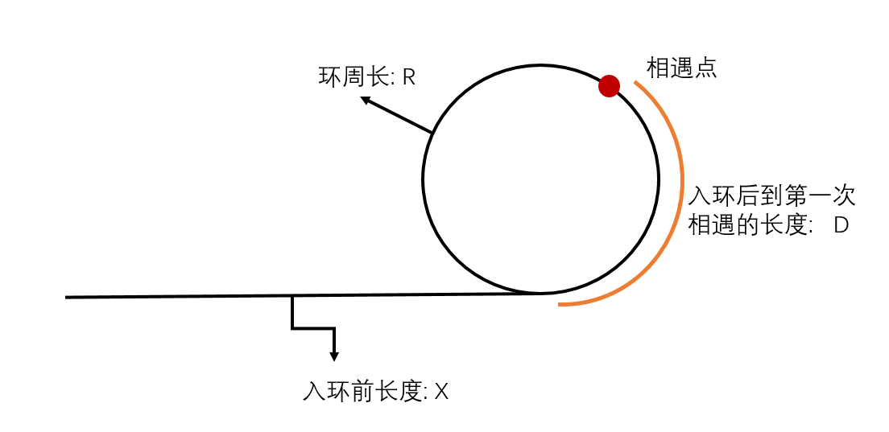
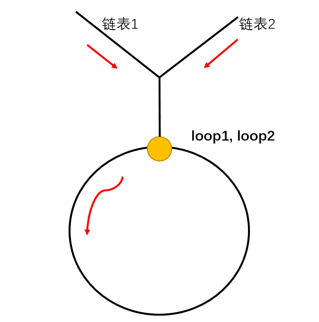
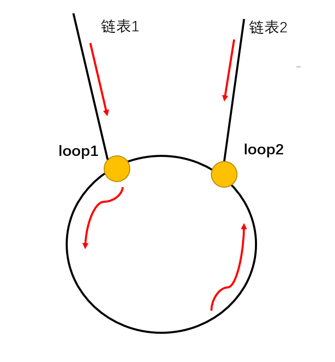

# 链表环路全家桶

*经典面试题*

## 两个单链表是否相交
本题中, 单链表可能有环, 也可能无环. 给定两个单链表的头结点 `head1` 和 `head2`, 这两个单链表可能相交, 也可能不相交.
要求实现一个函数, 如果两个链表相交, 请返回相交的第一个节点; 如果不相交, 则返回null;

**要求空间复杂度O(1)**

## 本问题可以分成三个子问题
1. 如何判断一个链表是否有环, 如果有, 则返回第一个进入环的节点, 没有则返回null

2. 如何判断两个**无环**链表是否相交, 相交则返回第一个相交节点, 不相交则返回null

3. 如何判断两个**有环**链表是否相交, 相交则返回第一个相交节点, 不相交则返回null

4. *如果一个链表有环, 另一个链表无环, 那他们是不可能相交的, 直接返回null*

## 问题一: 判断一个链表是否有环
1. 设置一个慢指针一个快指针从head开始遍历链表
2. 如果无环, fast指针一定会先到终点
3. 如果有环, fast指针一定会和slow指针相遇
4. 当fast和slow相遇, 把fast移回head位置, 然后两个指针都只移动一步, 继续遍历, 再次相遇的节点就是第一个入环的节点.



证明:
```
慢指针走过的距离 S<sub>slow</sub> = X + D  
快指针走过的距离 S<sub>fast</sub> = 2 * (X + D)  
S<sub>fast</sub> - S<sub>slow</sub> = X + D  
同时, S<sub>fast</sub> - S<sub>slow</sub> 等同于 **为了相遇而多跑的圈数** 即  
S<sub>fast</sub> - S<sub>slow</sub> = n * R (n = 1, 2, 3...)  
得到 X = n * R - D  
```
即两个指针的第二次相遇, 是一个指针回到原点在走X距离后,   
另一个指针从相遇点正好走了n圈, 并回退D步所处的位置, 即环入口.

## 问题二: 判断两个无环链表是否相交
关键在于, 如果两个无环链表相交, 那么从相交节点开始, 一直到两个链表终止这一段, 是两个链表共享的.

从两个链表头开始遍历, 遍历到链表末尾节点, 如果不一样则不相交.

如果末尾节点一样, 以`len1 = Len(List1)`, `len2 = Len(List2)`,  
让链表1先走(len1 - len2)步或者链表2先走(len2 - len1)步,  
两个链表第一次走到一起的那个节点就是第一个相交的节点.

## 问题三: 判断两个有环链表是否相交

记链表1的入环点为`loop1`, 链表2的入环点为`loop2`, 可以分成两种情况讨论:

1. 情况一: loop1 == loop2, 那么一定两个链表是相交的, 如下图所示  
      
    这种情况下我们只需要考虑链表1的头结点和链表2的头结点到入环点这段路程中的`第一个相交点`, 处理方法和问题二类似;
2. 情况二: loop1 != loop2, 那么又分两种情况:
    1. 两个链表不相交
    2. 两个链表相交:  
    若两个链表相交, 那么相交的节点一定在环上. (若不在环上还相交了, 就变成了情况一), 如下图所示:
      
    那么, **判断有没有交点**就从`loop1`开始遍历, 看在回到`loop1`之前能不能遇上`loop2`就可以了. 交点选`loop1`或者`loop2`均可.

