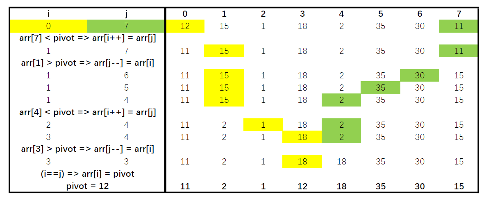

## 题目
设一组初始关键字记录关键字为（ 12,15,1,18,2,35,30,11 ），则以 12 为基准记录的一趟快速排序结束后的结果为  
1. `11，1，2，12，35，18，30，15`
2. `11，2，1，12，15，18，35，30`
3. `11，2，1，12，18，35，30，15`

## 解释
参考国内教科书标准的QuickSort的Partition实现  
*(我自己写的就不是这样的, 不过标准版代码很对称, 紧凑, 适合**记忆背诵**)*
```java
public class QuickSort {
    private static void partition(int[] arr, int low, int high) {
        int i, j;
        int pivot;

        i = low;
        j = high;
        pivot = arr[i];

        while (i < j) {
            while (i < j && arr[j] >= pivot) {
                j--;
            }
            if (i < j) {
                arr[i++] = arr[j];
            }
            while (i < j && arr[i] < pivot) {
                i++;
            }
            if (i < j) {
                arr[j--] = arr[i];
            }
        }
        arr[i] = pivot;
    }

    public static void main(String[] args) {
        int[] arr = {12, 15, 1, 18, 2, 35, 30, 11};
        partition(arr, 0, arr.length - 1);
        System.out.println(Arrays.toString(arr));
    }
}
```

本题数据的演示如下:  
  
