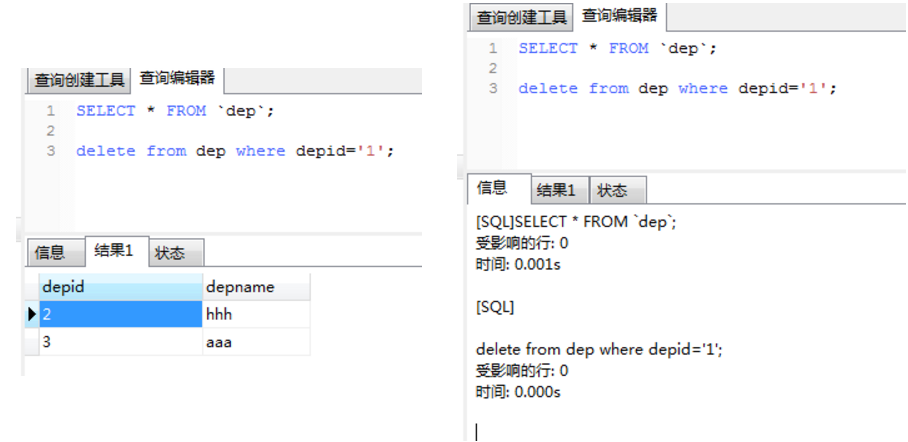

# 错题集

在关系型是数据库中，有两个不同的事务同时操作数据库中同一表的同一行，不会引起冲突的是  
- 其中一个DELETE操作，一个是SELECT操作
- 其中两个都是UPDATE
- 其中一个是SELECT，一个是UPDATE
- 两个都是DELETE
- 两个都是SELECT

答案是  
两个都是DELETE / 两个都是SELECT  
SELECT是只读操作, 不冲突  
DELETE时, 当要删除的记录子数据库中不存在时, **是不会报错的**.  

