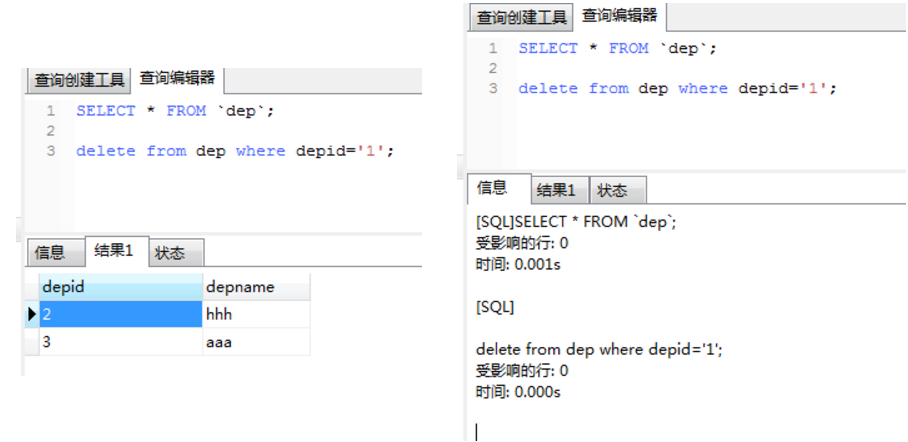

# 错题集

在关系型是数据库中，有两个不同的事务同时操作数据库中同一表的同一行，不会引起冲突的是  
- 其中一个DELETE操作，一个是SELECT操作
- 其中两个都是UPDATE
- 其中一个是SELECT，一个是UPDATE
- 两个都是DELETE
- 两个都是SELECT

答案是  
两个都是DELETE / 两个都是SELECT  
SELECT是只读操作, 不冲突  
DELETE时, 当要删除的记录子数据库中不存在时, **是不会报错的**.  

题目
---
以下哪个不是与Mysql服务器相互作用的通讯协议()
- TCP/IP
- UDP
- 共享内存
- Socket

答案
---
选"UDP"

MySQL实现了四种通信协议
1. TCP/IP协议，通常我们通过来连接MySQL，各种主要编程语言都是根据这个协议实现了连接模块
2. Unix Socket协议，这个通常我们登入MySQL服务器中使用这个协议，因为要使用这个协议连接MySQL需要一个物理文件，文件的存放位置在配置文件中有定义，值得一提的是，这是所有协议中最高效的一个。
3. Share Memory协议，这个协议一般人不知道，肯定也没用过，因为这个只有windows可以使用，使用这个协议需要在配置文件中在启动的时候使用–shared-memory参数.  
注意的是，使用此协议，一个host上只能有一个server，所以这个东西一般没啥用的，除非你怀疑其他协议不能正常工作，微软的`SQL Sever`也支持这个协议
4. Named Pipes协议，这个协议也是只有windows才可以用，同shared memory一样，使用此协议，一个host上依然只能有一个server，即使是使用不同的端口也不行，Named Pipes 是为局域网而开发的协议。  
内存的一部分被某个进程用来向另一个进程传递信息，因此一个进程的输出就是另一个进程的输入。第二个进程可以是本地的（与第一个进程位于同一台计算机上），也可以是远程的（位于联网的计算机上）。正因为如此，假如你的环境中没有或者禁用TCP/IP环境，而且是windows服务器，那么好歹你的数据库还能工作。使用这个协议需要在启动的时候添加–enable-named-pipe选项

题目
---
### SQL申明变量
下面的 SQL 命令中，可以将变量count值赋值为1的是  
- DIM@count=1 count=1
- DECLARE @count SELECT @count=1
- DECLARE count SELECT count=1
- DIM @count SELECT @count=1

答案
---
选`DECLARE @count SELECT @count=1`  
SQL中, @表示声明一个局部变量，@@表示声明一个全局变量 (比如已经定义好的系统变量)  
申明局部变量语法: declare @变量名 数据类型
- 例如：declare @num int；

赋值：有两种方法式（@num为变量名，value为值）
- set @num=value;   或   select @num=value;
