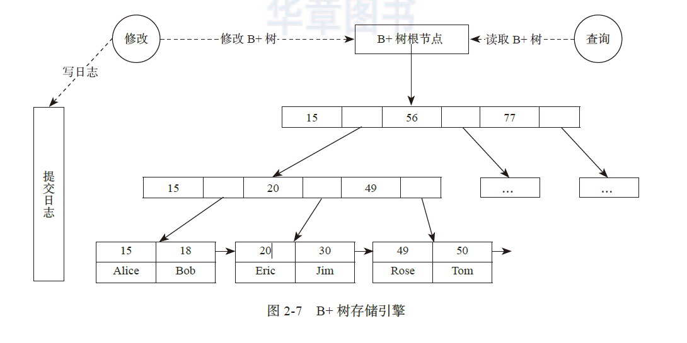

# 阅读笔记

单机环境 和 分布式环境 下的两个明显的不同
-
1. 首先, 分布式环境下会出现一部分计算机工作正常, 另一部分计算机工作不正常的情况, 程序需要在这种情况下尽可能地正常工作. 这个挑战非常大.
2. 其次, 单机环境下的函数调用常常可以在微秒级以内返回, 所以除了少数访问外部设备(例如磁盘/网卡等)的函数采用异步调用以外, 大部分函数采用同步调用的方式, 编译器和操作系统在调用前后自动保存与恢复程序的上下文*(中断恢复, 函数调用栈等概念)*; 在分布式环境下, 计算机之间的函数调用(远程调用, RPC)的返回时间通常是毫秒或者亚毫秒(0.1~1.0毫秒)级, 差不多是单机环境的100倍, 使用同步方式将远远不能发挥现代CPU处理器的性能, 所以分布式环境下的RPC通常采用**异步调用**的方式, **程序需要自己保存和恢复调用前后的上下文**, 并需要处理更多的异常.

磁盘的特性
-
磁盘读写带宽还是不错的，15000 转的*SATA*盘的顺序读取带宽可以达到100MB
以上，由于磁盘寻道的时间大约为10ms，顺序读取1MB 数据的时间为：磁盘寻道时间 + 数据读取时间,
即10ms + 1MB / 100MB/s×1000 = 20ms。

存储系统的性能瓶颈主要在于**磁盘随机读写**。
设计存储引擎的时候会针对磁盘的特性做很多的处理，比如将随机
写操作转化为顺序写，通过缓存减少磁盘随机读操作。

单机存储引擎
-
- 哈希存储引擎
- B树存储引擎 -> 关系数据库

        相比哈希存储引擎，B 树存储引擎不仅支持随机读取，还支持范围扫描。关系数据
        库中通过索引访问数据，在Mysql InnoDB 中，有一个称为聚集索引的特殊索引
        行的数据存于其中，组织成 B+ 树数据结构。
- LSM树(Log-Structured Merge Tree)存储引擎

MySQL的B+树
-
如下图所示，MySQL InnoDB 按照页面（Page）来组织数据，每个页面对应B+
树的一个节点。其中，叶子节点保存每行的完整数据，非叶子节点保存索引信息。

其中, B+ 树的根节点是常驻内存的，因此，B+ 树一次检索最多需要h-1 次磁盘IO，复杂度为O(h)=O(logdN)（N 为元素个数，d 为每个节点的出度，h 为B+ 树高度）

MySQL的缓冲区管理
-
缓冲区管理器负责将可用的内存划分成缓冲区，缓冲区是与页面同等大小的区域,
磁盘块的内容可以传送到缓冲区中。缓冲区管理器的关键在于替换策略，即选择将哪些
页面淘汰出缓冲池。

1. LRU
    - LRU 算法淘汰最长时间没有读或者写过的块。这种方法要求缓冲区管理器按照页
面最后一次被访问的时间组成一个链表，每次淘汰链表尾部的页面。直觉上，长时间没
有读写的页面比那些最近访问过的页面有更小的最近访问的可能性。
2. LIRS
    - **简单的LRU存在的问题**
    - LRU 算法在大多数情况下表现是不错的，但有一个问题：假如某一个查询做了一
次全表扫描，将导致缓冲池中的大量页面（可能包含很多很快被访问的热点页面）被
替换，从而污染缓冲池。
    - **解决方法**
    - 现代数据库一般采用LIRS 算法，将缓冲池分为两级，数据
首先进入第一级，如果数据在较短的时间内被访问两次或者以上，则成为热点数据进
入第二级，每一级内部还是采用LRU 替换算法。MySQL InnoDB 中的替换算法采用了类似的分级思想.
    - **例子**
    - InnoDB 内部的LRU 链表分为两部分：新子链表（new sublist）和老子链表（old
sublist），默认情况下，前者占5/8，后者占3/8。页面首先插入到老子链表，InnoDB 要
求页面在老子链表停留时间超过一定值，比如1 秒，才有可能被转移到新子链表。当出
现全表扫描时，InnoDB 将数据页面载入到老子链表，由于数据页面在老子链表中的停留
时间不够，不会被转移到新子链表中，这就避免了新子链表中的页面被替换出去的情况。

LSM引擎
-
LSM 树（Log Structured Merge Tree）的思想非常朴素，就是将对数据的修改增量
保持在内存中，达到指定的大小限制后将这些修改操作批量写入磁盘，读取时需要合并
磁盘中的历史数据和内存中最近的修改操作。LSM 树的优势在于有效地规避了磁盘随
机写入问题，但读取时可能需要访问较多的磁盘文件。

关系数据库在海量数据场景面临的挑战
-
1. 事务　  关系模型要求多个 SQL 操作满足 **ACID 特性**，所有的 SQL 操作要么全部
成功，要么全部失败。在分布式系统中，如果多个操作属于不同的服务器，保证
它们的**原子性**需要用到**两阶段提交协议**，而这个协议的性能很低，且不能容忍服
务器故障，很难应用在海量数据场景。

2. 联表　  传统的数据库设计时需要满足范式要求，例如，第三范式要求在一个关系
中不能出现在其他关系中已包含的非主键信息。假设存在一个部门信息表，其中
每个部门有部门编号、部门名称、部门简介等信息，那么在员工信息表中列出部
门编号后就不能加入部门名称、部门简介等部门有关的信息，否则就会有大量的
数据冗余。而**在海量数据的场景，为了避免数据库多表关联操作，往往会使用数据冗余**等违反数据库范式的手段。实践表明，这些手段带来的收益远高于成本。

3. 性能　  关系数据库采用 B 树存储引擎，更新操作性能不如 LSM 树这样的存储引擎。
另外，如果**只有基于主键**的增、删、查、改操作，关系数据库的性能也不如
专门定制的 Key-Value 存储系统。

事务与并发控制
-

### 事务和ACID
**事务**规范了数据库操作的语义，每个事务使得数据库从一个一致的状态原子地转
移到另一个一致的状态。数据库事务具有即ACID 属性，这些特性使得多个数据库事务并发执行时互不干扰，也不会获取到中间状态的错误结果。
- 原子性(Atomicity)
    - 事务的原子性首先体现在事务对数据的修改，即要么全都执行，要么全都不执行
    - 但是，事务的原子性并不总是能够保证修改一定完成了或者一定没有进行
    - 事务的原子性也体现在事务对数据的读取上，例如，一个事务对同一数据项的多次读取的结果一定是相同的。

- 一致性(Consistency)
    - 一致性由数据库的内部规则保证. 
    - 例如数据的类型必须正确，数据值必须在规定的范围内
    - 另外一些时候这种一致性由应用保证
    - 例如一般情况下银行账务余额不能是负数，信用卡消费不能超过该卡的信用额度等。

- 隔离性(Isolation)
    - 许多时候数据库在**并发**执行多个事务，每个事务可能需要对多个表项进行修改和查询. 与此同时，更多的查询请求可能也在执行中。
    - 数据库需要保证每一个事务在它的修改全部完成之前，对其他的事务是不可见的
        - 换句话说，不能让其他事务看到该事务的中间状态.
        - 例如，从银行账户A 转一笔款项a 到账户B，不能让其他事务（例如账户查询）看到A 账户已经扣除款项a 但B 账户却还没有增加款项a的状态。 

- 持久性(Durability)
    - 事务完成后，它对于数据库的影响是永久性的.

### 可串行化

多个事务并发执行时，如果它们的执行结果和按照某种顺序一个接着一个串行执行
的效果等同，这种隔离级别称为**可串行化**。

可串行化是比较**理想**的情况，商业数据库为了性能考虑，往往会定义多种隔离级别。

事务的并发控制一般通过锁机制来实现，锁可以有不同的粒度，可以锁住行，也可以锁住数据块甚至锁住整个表格。

### 并发控制

出于性能考虑，许多数据库允许使用者选择**牺牲隔离属性**来换取并发度，从而获得性能的提升。SQL 定义了4 种隔离级别。

- Read Uncommitted (RU):
    - 读取未提交的数据，即其他事务已经修改但还未提交的数据，这是最低的隔离级别；
- Read Committed (RC):
    - 读取已提交的数据，但是，在一个事务中，对同一个项，前后两次读取的结果可能不一样，例如第一次读取时另一个事务的修改还没有提交，第二次读取时已经提交了；
- Repeatable Read (RR): 
    - 可重复读取，在一个事务中，对同一个项，确保前后两次读取的结果一样；
- Serializable (S): 
    - 可序列化，即数据库的事务是可串行化执行的，就像一个事务执行的时候没有别的事务同时在执行，这是最高的隔离级别。

#### 降低隔离级别带来的异常
- Lost Update (LU)
    - 两个事务同时修改一个数据项，但后一个事务中途失败回滚，则前一个事务已提交的修改都可能丢失；
- Dirty Reads (DR)
    - 一个事务读取了另外一个事务更新却没有提交的数据项；
- Non-Repeatable Reads (NRR)
    - 一个事务对同一数据项的多次读取可能得到不同的结果；
- Second Lost Updates problem (SLU)
    - 两个并发事务同时读取和修改同一数据项，则后面的修改可能使得前面的修改失效；
- Phantom Reads (PR)
    - 事务执行过程中，由于前面的查询和后面的查询的期间有另外一个事务**插入**数据，后面的查询结果出现了前面查询结果中未出现的数据。

由下表可见, 所有的隔离级别都保证不会出现第一类丢失更新，
另外，在最高隔离级别（Serializable）下，数据不会出现读写的不一致。

/                | Lost Update | Dirty Reads | Non-Repeatable Reads | Second Lost Updates problem | Phantom Reads
-----------------|-------------|-------------|----------------------|-----------------------------|--------------
Read Uncommitted |     x       |      √      |          √           |             √               |       √
Read Committed   |     x       |      x      |          √           |             √               |       √
Repeatable Read  |     x       |      x      |          x           |             x               |       √
Serializable     |     x       |      x      |          x           |             x               |       x

由于互联网业务中读事务的比例往往远远高于写事务，为了提高读事务性能，可以采用写时复制（Copy-
On-Write，COW）或者多版本并发控制（Multi-Version Concurrency Control，MVCC）
技术来避免写事务阻塞读事务。

### 事务并发可能引入死锁

T1         | T2         |  A | B
-----------|------------|----|----
READ(A, t) |            | 25 | 25
t := t+100 | READ(B, s) |    |
WRITE(B, t)| s = s * 2  |    |
\          |WRITE(A, s) |    |

在上图这种情况下
- T1持有A的读锁, 需要获取B的写锁; 
- T2持有B的读锁, 需要获取A的写锁;

解决思路
1. 为每个事务设置一个超时的时间, 超时后自动回滚
2. 死锁检测 死锁出现的原因在于十五之前的互相依赖, 检测到依赖环路后通过回滚其中某些事务来消除循环依赖.

## 并发控制: 写时复制

核心就是不用加读锁的读写分离方法

<http://ifeve.com/java-copy-on-write/>
聊聊并发-Java中的Copy-On-Write容器

Copy-On-Write简称COW，是一种用于程序设计中的优化策略。其基本思路是，从一开始大家都在共享同一个内容，当某个人想要修改这个内容的时候，才会真正把内容Copy出去形成一个新的内容然后再改，这是一种延时懒惰策略。从JDK1.5开始Java并发包里提供了两个使用CopyOnWrite机制实现的并发容器,它们是CopyOnWriteArrayList和CopyOnWriteArraySet。CopyOnWrite容器非常有用，可以在非常多的并发场景中使用到。

通俗的理解是当我们往一个容器添加元素的时候，不直接往当前容器添加，而是先将当前容器进行Copy，复制出一个新的容器，然后新的容器里添加元素，添加完元素之后，再将原容器的引用指向新的容器。

可以发现在添加的时候是需要加锁的，否则多线程写的时候会Copy出N个副本出来。

使用CopyOnWriteMap需要注意两件事情：

1. 减少扩容开销。根据实际需要，初始化CopyOnWriteMap的大小，避免写时CopyOnWriteMap扩容的开销。

2. 使用批量添加。因为每次添加，容器每次都会进行复制，所以减少添加次数，可以减少容器的复制次数。如使用上面代码里的addBlackList方法。

CopyOnWrite的缺点:

1. **内存占用问题**。因为CopyOnWrite的写时复制机制，所以在进行写操作的时候，内存里会同时驻扎两个对象的内存，旧的对象和新写入的对象（注意:在复制的时候**只是复制容器里的引用**，只是在写的时候会创建新对象添加到新容器里，而旧容器的对象还在使用，所以有两份对象内存）。

2. **数据一致性问题**。CopyOnWrite容器只能保证数据的最终一致性，不能保证数据的实时一致性。所以如果你希望写入的的数据，马上能读到，请不要使用CopyOnWrite容器。

### B+树执行写操作的步骤

1. 拷贝：将从叶子到根节点路径上的所有节点拷贝出来。
2. 修改：对拷贝的节点执行修改。
3. 提交：原子地切换根节点的指针，使之指向新的根节点。

如果读操作发生在第 3 步提交之前，那么，将读取老节点的数据，否则将读取新节点，读操作不需要加锁保护。写时复制技术涉及引用计数，对每个节点维护一个引用计数，表示被多少节点引用，如果引用计数变为0，说明没有节点引用，可以被垃圾回收。

写时复制技术原理简单，问题是每次写操作都需要拷贝从叶子到根节点路径上的
所有节点，写操作成本高. 

另外，多个写操作之间是互斥的，同一时刻只允许一个写操作。

## 并发控制: 多版本并发控制

MVCC(Multi-Version Concurrency Control), 也能够实现读事务不加锁.

MVCC对每行数据维护多个版本, 无论事务执行时间有多长, MVCC 总是能够提供与事务开始时刻相一致的数据.

以MySQL InnoDB存储引擎为例, InnoDB在每一行记录的后面增加两个隐藏列，记录创建版本号和删除版本号，而每一个事务在启动的时候，都有一个唯一的递增的版本号。

1. 储存被修改的"时间"
2. 储存被删除的"时间"
3. 其实不是绝对时间, 而是与时间对应的数据库系统的版本号
 
因此这个版本号也可以被认为是"事务号".

对于每一行查询语句，InnoDB 都会把这个查询语句的版本号同这个查询语句遇到的行
的版本号进行对比，然后结合不同的**事务隔离级别**，来决定是否返回该行。

下面分别以SELECT、DELETE、INSERT、UPDATE 语句来说明。

1. SELECT
    - 对于SELECT 语句，只有同时满足了下面两个条件的行，才能被返回：
    - 行的修改版本号小于等于该事务号。
    - 行的删除版本号要么没有被定义，要么大于事务的版本号。
        - 如果行的修改或者删除版本号大于事务号，说明行是被该事务后面启动的事务修改或者删除的。在可重复读取隔离级别(RR)下，后开始的事务对数据的影响不应该被先开始的事务看见，所以应该忽略后开始的事务的更新或者删除操作。
2. INSERT
    - 对新插入的行，行的修改版本号更新为该事务的事务号。
3. DELETE
    - 对于删除，InnoDB 直接把该行的删除版本号设置为当前的事务号，相当于标记为
删除，而不是物理删除。
4. UPDATE
    - 在更新行的时候，InnoDB 会把原来的行**复制**一份，并把当前的事务号作为该行的修改版本号。

**MVCC 读取数据的时候不用加锁**，每个查询都通过**版本检查**，只获得自己需要的数据版本，从而大大提高了系统的并发度。

当然，为了实现多版本，必须对每行存储额外的多个版本的数据。另外，MVCC 存储引擎还必须定期删除不再需要的版本，及时回收空间。

## 列式存储 / OLTP / OLAP

数据处理大致可以分成两大类:

- 联机事务处理OLTP(on-line transaction processing)
    - OLTP是传统的关系型数据库的主要应用，主要是基本的、日常的事务处理，例如**银行交易**。
    - 事务性非常高的系统，一般都是高可用的在线系统，以小的事务以及小的查询为主.
    - **评估**其系统的时候，一般看其每秒执行的Transaction以及Execute SQL的数量。
- 联机分析处理OLAP(On-Line Analytical Processing)
    - OLAP 系统则强调数据分析，强调SQL执行市场，强调磁盘I/O，强调分区等。 
    - 在这样的系统中，语句的执行量不是考核标准，因为一条语句的执行时间可能会非常长，读取的数据也非常多。所以，在这样的系统中，考核的标准往往是磁盘子系统的吞吐量（带宽），如能达到多少MB/s的流量。