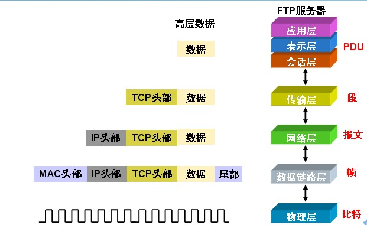
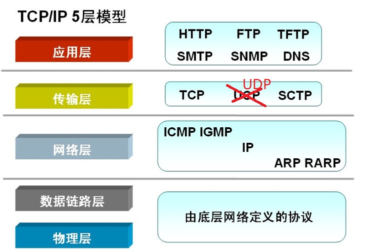

# TCP复习
既然要做web开发, tcp作为可靠传输协议是必须要了解的内容.

笔记主要参考自陈皓<TCP 的那些事儿> <http://coolshell.cn/articles/11564.html>

通过本文整理, 想要搞清楚的有以下几个内容:
1. **Motivation** TCP协议在五层/七层模型中的位置和作用
2. **defination** TCP协议的定义
3. **Detail**
    1. 头格式
    2. 状态机
    3. 重传机制

## TCP/IP五层模型 & OSI七层模型
先上第一张图: TCP/IP五层模型 & OSI七层模型

可以看到OSI 7层模型主要是对TCP/IP 5层模型中**应用层**的扩展.

OSI七层模型中:
- 传输层：负责传送完整的报文、流量及差错控制。
- 会话层：负责建立、维护、终止、会话连接、提供会话管理服务。
- 表示层：负责数据格式的转换。
- 应用层：负责给应用程序提供接口。

首先,我们需要知道TCP在网络OSI的七层模型中的第四层——传输层(Transport)，IP在第三层——网络层(Network层)，ARP在第二层——数据链路层(Data Link层)，在第二层上的数据，我们叫Frame，在第三层(网络层, IP)上的数据叫Packet，第四层(传输层, TCP)的数据叫Segment.

我们程序的数据首先会打到TCP的**Segment**中, 然后TCP的Segment会打到IP的**Packet**中，然后再打到以太网Ethernet的**Frame**中，传到对端后, 各个层解析自己的协议, 然后把数据交给更高层的协议处理. 如下所示.

# TCP/IP 5层模型(TCP全家桶)中各层协议所在的的位置
TCP提供了一个协议全家桶, 如下图所示.

- 网络层：
    - TCP/IP定义了网际协议。
    - IP的四个支撑协议：
    - ARP—地址解析协议。 (address resolution)，实现通过IP地址得知其物理MAC地址. ARP协议只用在局域网中.
    - RARP—逆地址解析协议。
    - ICMP—网际控制报文协议。 主机探测 / 路由维护 / 路由选择 / 流量控制 ICMP可以实现故障隔离和故障恢复。
    - IGMP—网际组管理协议。
- 传输层：
    - TCP—传输控制协议。
    - UDP—用户数据报协议。

- 应用层:
    - 基于TCP
        - FTP 端口 20/21 用于传输文件
        - SSH 默认端口 22
        - TELNET 端口 23
        - SMTP 端口 25
        - HTTP 端口 80
    - 基于UDP
        - TFTP 端口 69 简单文件传输协议
        - RPC 端口 111 远程过程调用
        - NTP 端口 123 网络时间协议

## TCP的头格式
TCP 头格式如下所示:

可以看到:
1. TCP包中是没有IP地址的, 但是有源端口和目的端口.

2. 一个TCP连接需要四个元组来表示是同一个连接(src_ip, src_port, dst_ip, dst_port). 准确说是五元组, 还有一个是协议.

3. 注意上图中的四个非常重要的东西：
    1. Sequence Number是包的序号，用来解决网络包乱序(reordering)问题。  
       一条TCP连接的双方均可以随机的选择初始序号.  
       好处是减少那些仍在网络中存在的 来自两台主机之间 先前已终止的连接的报文段,  
       **误认为**是后来这两台主机之间新建连接所产生的有效报文段的可能性
    
    2. Acknowledgement Number 就是ACK——用于确认收到，用来解决不丢包的问题。  
       **主机A填充进报文段的确认号ACK是主机A期望从主机B收到的下一个字节的序号**  
       TCP只确认流中至第一个丢失字节为止的字节
    
    3. Window又叫Advertised-Window, 也就是著名的滑动窗口(Sliding Window)，用于解决控制的。
    
    4. TCP Flag, 也就是包的类型，主要是用于操控**TCP的状态机**的。
        - 其中, ACK是确认位, 在连接建立之后所有传送的报文段都必须把ACK置1.
        - RST是 复位位(Reset) -- 当RST=1, 表明TCP连接中出现了严重差错(比如主机崩溃), 必须释放连接, 然后再重新建立传输连接.
        - SYN 是 同步位 -- 同步表示这是一个连接请求或者连接接受报文.
            - SYN = 1, ACK = 0, 连接请求
            - SYN = 1, ACK = 1, 连接接受

## TCP的状态机

其实，**网络上的传输是没有连接的，包括TCP也是一样的。**而TCP所谓的“连接”，其实只不过是在通讯的双方维护一个“连接状态”, 让它看上去好像有连接一样. 所以, TCP的状态变换是非常重要的.

下面是：“TCP协议的状态机” 和 “TCP建链接”、“TCP断链接”、“传数据” 的对照图，非常非常的重要，一定要记牢。(陈皓：看到这样复杂的状态机，就知道这个协议有多复杂，复杂的东西总是有很多坑爹的事情，所以TCP协议其实也挺坑爹的)

客户端先发送一个特殊的TCP报文段, 服务器用另一个特殊的TCP报文段来响应.  
最后, 客户在用第三个特殊的报文段作为响应. => `3次握手`  
其中, 前两个报文段不承载有效载荷(应用层的数据), **而第三个报文段可以承载有效载荷**.

TCP从**发送缓存**中取出并放入报文段的数据大小受限于`最大报文段长度 MSS(Maximum Segment Size)`  
MSS长根据主机的最大链路层帧长度(`最大传输单元 MTU(Maximum Transmission Unit)`)设置.

很多人会问，为什么建链接要3次握手，断链接需要4次挥手？

- 对于建链接的3次握手，主要是要初始化Sequence Number 的初始值。通信的双方要互相通知对方自己的初始化的Sequence Number（缩写为ISN：Inital Sequence Number）——所以叫SYN，全称**Syn**chronize Sequence Numbers。也就上图中的 x 和 y。这个号要作为以后的数据通信的序号, 以保证应用层接收到的数据不会因为网络上的传输的问题而乱序(TCP会用这个序号来拼接数据).
- 对于4次挥手，其实你仔细看是2次，因为TCP是全双工的，所以，发送方和接收方都需要Fin和Ack。只不过，**有一方是被动的**，所以看上去就成了所谓的4次挥手。如果两边同时断连接，那就会就进入到CLOSING状态，然后到达TIME_WAIT状态。下图是双方同时断连接的示意图(你同样可以对照着TCP状态机看):
    
    

另外，有几个事情需要注意一下:
- **关于建连接时SYN超时。**试想一下，如果server端接到了clien发的SYN后回了SYN-ACK后client掉线了，server端没有收到client回来的ACK，那么，这个连接处于一个中间状态，即没成功，也没失败。于是，server端如果在一定时间内没有收到的TCP会重发SYN-ACK。在Linux下，默认重试次数为5次，重试的间隔时间从1s开始每次都翻售，5次的重试时间间隔为1s, 2s, 4s, 8s, 16s，总共31s，第5次发出后还要等32s都知道第5次也超时了，所以，总共需要 1s + 2s + 4s+ 8s+ 16s + 32s = 2^6 -1 = 63s，TCP才会把断开这个连接。
- **关于SYN Flood攻击。**一些恶意的人就为此制造了SYN Flood攻击——给服务器发了一个SYN后，就下线了，于是服务器需要默认等63s才会断开连接，这样，攻击者就可以把服务器的syn连接的队列耗尽，让正常的连接请求不能处理。于是，Linux下给了一个叫tcp_syncookies的参数来应对这个事——当SYN队列满了后，TCP会通过源地址端口、目标地址端口和时间戳打造出一个特别的Sequence Number发回去（又叫cookie），如果是攻击者则不会有响应，如果是正常连接，则会把这个 SYN Cookie发回来，然后服务端可以通过cookie建连接（即使你不在SYN队列中）。请注意，请先千万别用tcp_syncookies来处理正常的大负载的连接的情况。因为，synccookies是妥协版的TCP协议，并不严谨。对于正常的请求，你应该调整三个TCP参数可供你选择，第一个是：tcp_synack_retries 可以用他来减少重试次数；第二个是：tcp_max_syn_backlog，可以增大SYN连接数；第三个是：tcp_abort_on_overflow 处理不过来干脆就直接拒绝连接了。
- **关于 MSL 和 TIME_WAIT。**
通过上面的ISN的描述，相信你也知道MSL是怎么来的了。我们注意到，在TCP的状态图中，从TIME_WAIT状态到CLOSED状态，有一个超时设置，这个超时设置是 2*MSL(RFC793定义了MSL为2分钟，Linux设置成了30s)
- **为什么要这有TIME_WAIT?**
    - 为什么不直接给转成CLOSED状态呢？主要有两个原因: 
    - TIME_WAIT确保有足够的时间让对端收到了ACK，如果被动关闭的那方没有收到ACK，就会触发被动端重发Fin，一来一去正好2个MSL
    - 有足够的时间让这个连接不会跟后面的连接混在一起 (你要知道，有些自做主张的路由器会缓存IP数据包，如果连接被重用了，那么这些延迟收到的包就有可能会跟新连接混在一起). 
    - 其实，TIME_WAIT表示的是你主动断连接，所以，这就是所谓的“不作死不会死”。试想，如果让对端断连接，那么这个破问题就是对方的了。另外，如果你的服务器是于HTTP服务器，那么设置一个HTTP的KeepAlive有多重要(浏览器会重用一个TCP连接来处理多个HTTP请求), 然后让客户端去断链接(你要小心，浏览器可能会非常贪婪，他们不到万不得已不会主动断连接)。

## TCP重传机制
TCP要保证所有的数据包都可以到达，所以，必需要有重传机制。

注意，**接收端给发送端的Ack确认只会确认最后一个连续的包**，比如，发送端发了1,2,3,4,5一共五份数据，接收端收到了1，2，于是回ack 3，然后收到了4（注意此时3没收到），此时的TCP会怎么办？我们要知道，因为正如前面所说的，**SeqNum和Ack是以字节数为单位**，所以ack的时候，不能跳着确认，只能确认最大的连续收到的包，不然，发送端就以为之前的都收到了。

### 超时重传机制
一种是不回ack，死等3，当发送方发现收不到3的ack超时后，会重传3。一旦接收方收到3后，会ack回4 => 意味着3和4都收到了。

但是，这种方式会有比较严重的问题，那就是因为要死等3，所以会导致4和5即便已经收到了，而发送方也完全不知道发生了什么事，因为没有收到Ack，所以，发送方可能会悲观地认为也丢了，所以有可能也会导致4和5的重传。

对此有两种选择：

- 一种是仅重传timeout的包。也就是第3份数据。
- 另一种是重传timeout后所有的数据，也就是第3，4，5这三份数据。

这两种方式有好也有不好。第一种会节省带宽，但是慢，第二种会快一点，但是会浪费带宽，也可能会有无用功。但总体来说都不好。因为都在等timeout，timeout可能会很长.

### 快速重传机制
于是，TCP引入了一种叫Fast Retransmit 的算法，不以时间驱动，而以数据驱动重传。也就是说，如果，包没有连续到达，就ack最后那个可能被丢了的包，如果发送方连续收到3次相同的ack，就重传。Fast Retransmit的好处是不用等timeout了再重传。

比如：如果发送方发出了1，2，3，4，5份数据，第一份先到送了，于是就ack回2，结果2因为某些原因没收到，3到达了，于是还是ack回2，后面的4和5都到了，但是还是ack回2，因为2还是没有收到，于是发送端收到了三个ack=2的确认，知道了2还没有到，于是就马上重转2。

然后，接收端收到了2，此时因为3，4，5都收到了，于是ack回6。示意图如下：

Fast Retransmit只解决了一个问题，就是timeout的问题，它依然面临一个艰难的选择，就是，是重传之前的一个还是重传所有的问题。对于上面的示例来说，是重传#2呢还是重传#2，#3，#4，#5呢？因为发送端并不清楚这连续的3个ack(2)是谁传回来的？也许发送端发了20份数据，是#6，#10，#20传来的呢。这样，发送端很有可能要重传从2到20的这堆数据(这就是某些TCP的实际的实现)。
