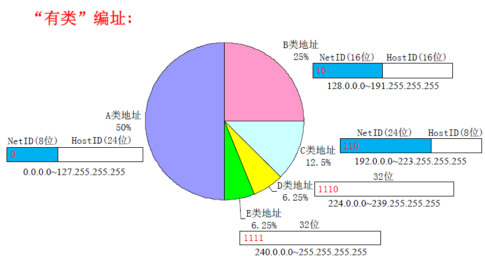

题
-
下面哪种协议在数据链路层？

ARP/ICMP/FTP/UDP/HTTP/VPN

解析
-
ICMP是网络层，UDP是传输层，FTP和HTTP是应用层
目前VPN隧道协议主要有4种

- 点到点隧道协议PPTP
- 第二层隧道协议L2TP
- 网络层隧道协议IPSec以及SOCKS v5协议
- 其中，PPTP和L2TP工作在数据链路层，IPSec工作在网络层，SOCK v5工作在会话层。

ARP和RARP 是网络层的协议，但是它所工作的内容是链路层的。
具体来说应该是在网络层。

地址解析协议（Address Resolution Protocol，ARP）是在仅知道主机的IP地址时确定其物理地址的一种协议。因IPv4和以太网的广泛应用，其主要用作将IP地址翻译为以太网的MAC地址，但其也能在ATM和FDDIIP网络中使用。从IP地址到物理地址的映射有两种方式：表格方式和非表格方式。ARP具体说来就是将网络层（IP层，也就是相当于OSI的第三层）地址解析为数据连接层（MAC层，也就是相当于OSI的第二层）的MAC地址。

题目
-
TCP为什么要三次握手, 而不能二次握手?

解释
-
谢希仁版《计算机网络》中的例子是这样的:

“已失效的连接请求报文段”的产生在这样一种情况下：client发出的第一个连接请求报文段并没有丢失，而是在某个网络结点长时间的滞留了，以致延误到连接释放以后的某个时间才到达server。

本来这是一个早已失效的报文段。但server收到此失效的连接请求报文段后，就误认为是client再次发出的一个新的连接请求。于是就向client发出确认报文段，同意建立连接。

假设不采用“三次握手”，那么只要server发出确认，新的连接就建立了。由于现在client并没有发出建立连接的请求，因此不会理睬server的确认，也不会向server发送ack包。

*此时因为client没有发起建立连接请求，所以client处于CLOSED状态，接受到任何包都会丢弃，谢希仁举的例子就是这种场景。但是如果服务器发送对这个延误的旧连接报文的确认的同时，客户端调用connect函数发起了连接，就会使客户端进入SYN_SEND状态，当服务器那个对延误旧连接报文的确认传到客户端时，因为客户端已经处于SYN_SEND状态，所以就会使客户端进入ESTABLISHED状态，此时服务器端反而丢弃了这个重复的通过connect函数发送的SYN包，见第三个图。而连接建立之后，发送包由于SEQ是以被丢弃的SYN包的序号为准，而服务器接收序号是以那个延误旧连接SYN报文序号为准，导致服务器丢弃后续发送的数据包）但server却以为新的运输连接已经建立，并一直等待client发来数据。这样，server的很多资源就白白浪费掉了。采用“三次握手”的办法可以防止上述现象发生。例如刚才那种情况，client不会向server的确认发出确认。server由于收不到确认，就知道client并没有要求建立连接。*

对讲机：
- C ->S: 你能听到吗？
- S->C: 听到。你能听到我吗？
- C->S:听到。

题目
---
### IPv4地址
下列哪个IP地址可以分配给一台计算机?
- A. 256.1.3.4
- B. 197.3.11.0
- C. 199.5.89
- D. 11.15.33.235

解
---

A的地址范围不对, 不会出现256  
B为一个C类地址(192.0.0.0 ~ 223.255.255.255), HostID是后8位
当主机号全为0是, 表示一个网段  
当主机号全为1时候, 是一个指向网络的广播  
所以B代表一个网段  
C不是IPv4的表述  
D是一个A类地址, 可以分配给一个计算机
