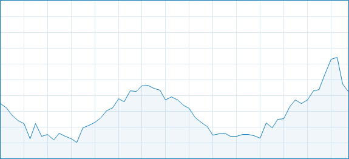

# 控制CPU的使用率

*主要参考<编程之美>*

关键点在于:
```cpp
for(int i = 0; ; i++){
    if(busy) {
        ;
    } 
    else { // not busy
        ;  // 干什么?
    }
}
```
else里应该干什么呢?

看操作系统教材中, 如果循环中使用空语句, 就得到了一个`spin lock`, 也就是`自旋锁`,  
而自旋锁是会占用系统时间的.

那么思路就是当执行到else里的语句时候, 程序(的进程)就**放弃**当前时间片,  
转入sleep状态, 并在合适的时间转回ready状态, 等待操作系统下次给它时间片进入running.

另外, 我们希望调度时间片和线程Sleep的时间呈整数倍关系  
(<编程之美>书上给的windows调度时间片是`10ms`),  
这样可以减少ready状态带来的误差, 而且若进程的Sleep的时间太小,  
就会导致频繁的系统调用, 增加程序的不稳定性.

而简单循环中的汇编指令示意如下:
```assembly
* next:
    #1 mov eax,       *ptr_to_i;   i 放入寄存器
    #2 add eax,       1;           eax 加 1
    #3 mov *ptr_to_i, eax;         将 eax 中的值写回 i
    #4 cmp eax,       *ptr_to_n;   比较 i 和 n
    #5 jl  next;                   i < n 时循环
```

本机CPU i5-7300U,  boost之前2.6GHz, boost之后3.5GHz
	 * 每个时钟周期认为可以执行两行指令, 一次循环中有五条指令
	 * (3 500 000 000 * 2) / 5 =  1 400 000 000
	 * 如果一秒一次可能会变成矩形, 尝试10ms一次, 因此循环14 000 000次
	 * 初始尝试: n = 14,000,000

第一次试验结果:  
- 第一次试验, CPU稳定在2.50GHz, 使用率20%左右(双核处理器,因此目标25%)
- 可能是现在处理器每个时钟中期可以处理3个左右指令?
    - (3 500 000 000 * 3) / 5 =  1 500 000 000

第二次试验结果:  
- 第二次试验, 改为n = 15,000,000次循环, CPU占用率提升到22-24%波动
- n的增大和cpu占用率应该是线性的, 调整到16,000,000?

第三次试验结果:
- CPU激活了Boost, 稳定在3.1GHz, CPU占用率站在26%左右

# 按正弦曲线波动
这个比控制CPU精确的占用简单一些, 因为只需要相对的变化趋势.

核心点在于: `分配忙和等的时间比例`

代码如下

```cpp
// C++ code to make task manager generate sine graph

#include <Windows.h>
#include <stdlib.h>
#include <math.h>
#include <stdio.h>

// 把一条正弦曲线0~2pi之间的弧度分成200份进行抽样
// 然后每个300ms取下一个抽样点, 并让CPU工作对应振幅的时间

const int SLICE = 200; // 抽样点数量
const double PI = 3.1415926535;
const DWORD TIME_SPAN = 100; // 抽样点对应时间片

int main(int argc, char * argv[])
{
	DWORD busySpan[SLICE];
	long amp = TIME_SPAN / 2;
	double radian = 0.0;
	double radianIncrement = 2.0 * PI / (double) SLICE;
	for (int i = 0; i < SLICE; i++) {
		busySpan[i] = (DWORD)(amp + amp * sin(radian));
		radian += radianIncrement;
		printf("%ld    %ld\n", busySpan[i], TIME_SPAN - busySpan[i]);
	}
	system("PAUSE");
	DWORD startTime = 0;
	
	for (int i = 0;; i = (i + 1) % SLICE)
	{
		startTime = GetTickCount();
		while ((GetTickCount() - startTime) <= busySpan[i]) {
			;
		}
		Sleep(TIME_SPAN - busySpan[i]);
	}
	
	return 0;
}
```

`GetTickCount()`可以得到的是 `系统启动到现在` 所经历的**毫秒值**, 最多能统计49.7天.

其中DWORD 其实是 unsigned long long,  考虑到DWORD是GetTickCount()系统函数的返回类型, 因此创建的数组为DWOED数组.

结果不理想...  


和后台很多噪音进程大概有关系, 还有要考虑GetTickCount()带来的内核的波动

## 改进
To be continued...